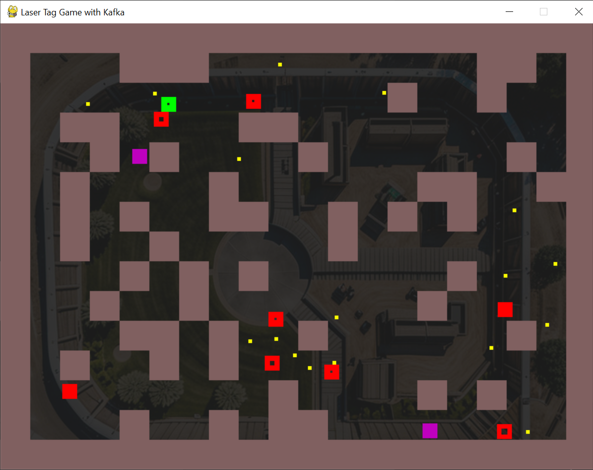

# 🎯 Laser Tag Kafka

Welcome to **Laser Tag Kafka**, a fast-paced multiplayer maze shooter built with **Python** and powered by **Kafka**!  
Each player runs their own game instance and connects via Kafka topics to battle it out in a shared arena.

Whether you're dodging enemy fire or strategizing with your local setup, this project is as much about learning as it is about blasting pixel enemies.

### Screenshot of the Menu


---

## ✨ Features

- 🔫 **Local & Remote Enemies**: You're always one player. Others are remote enemies, controlled in real time via Kafka messages.
- 💡 **Multiplayer with Kafka**: Every move, shot, and hit is synced through a Kafka topic — no central server needed.
- 🖥️ **Play on Your Own LAN**: Yes, really! With a bit of setup, you can run the game with friends over your home network.
- 🧰 **Simple Python Setup**: No external game engine — just good ol' `pygame`, some Kafka magic, and Python muscles.
- 📜 **Step-by-Step Evolution**: Curious how it all came together? Check the [`historic`](https://github.com/sght500/laser-tag-kafka/tree/main/historic) folder to trace the project’s evolution from basic mechanics to Kafka-enabled multiplayer!
- 🔉 **Custom Music**: Background music composed with [Suno](https://suno.com/song/9baf2d93-05de-4c59-8f1a-c412517e57a1), bringing the jungle skirmish vibes to your ears!

---

## 🚀 Getting Started

Make sure to check out the full [Setup Process](https://github.com/sght500/laser-tag-kafka/blob/main/setup/SETUP_PROCESS.md) to configure Kafka and run the game on your local network.

Install the required packages:

```bash
pip install -r requirements.txt
```

Then launch your instance:

```bash
python laser-tg.py
```

And get them all with the Shoot keys!

### Screenshot of the Game in Action



---

## 🎮 Controls

- **Move with Keys**: `W`, `A`, `S`, `D`  
- **Shoot with Keys**: `I`, `J`, `K`, `L`  

Each player runs their own instance of the game — remote enemies are just other players playing elsewhere!

---

## 📜 Licenses

This project uses a mix of open licenses:

- Game code: [GPL-3.0 License](https://github.com/sght500/laser-tag-kafka/blob/main/LICENSE)
- Fonts: Covered under [SIL Open Font License 1.1](https://github.com/sght500/laser-tag-kafka/blob/main/LICENSES.md) and [Apache 2.0](https://github.com/sght500/laser-tag-kafka/blob/main/LICENSES.md)
- Music: Created via [Suno](https://suno.com) – see track [here](https://suno.com/song/9baf2d93-05de-4c59-8f1a-c412517e57a1)

Full license details: [LICENSES.md](https://github.com/sght500/laser-tag-kafka/blob/main/LICENSES.md)

---

## 🤝 Contributing

Want to join the tag frenzy or improve the code?  
Check the [CONTRIBUTING.md](https://github.com/sght500/laser-tag-kafka/blob/main/CONTRIBUTING.md) and follow our [Code of Conduct](https://github.com/sght500/laser-tag-kafka/blob/main/CODE_OF_CONDUCT.md).

---

## 🕰️ Historical Builds

If you're curious about how the game evolved from simple player movement to Kafka-powered mayhem, check out the [`historic`](https://github.com/sght500/laser-tag-kafka/tree/main/historic) folder.  
Each version captures a working stage in the development process — a great way to learn by example.

---

Now go tag some lasers! 🔫💥
