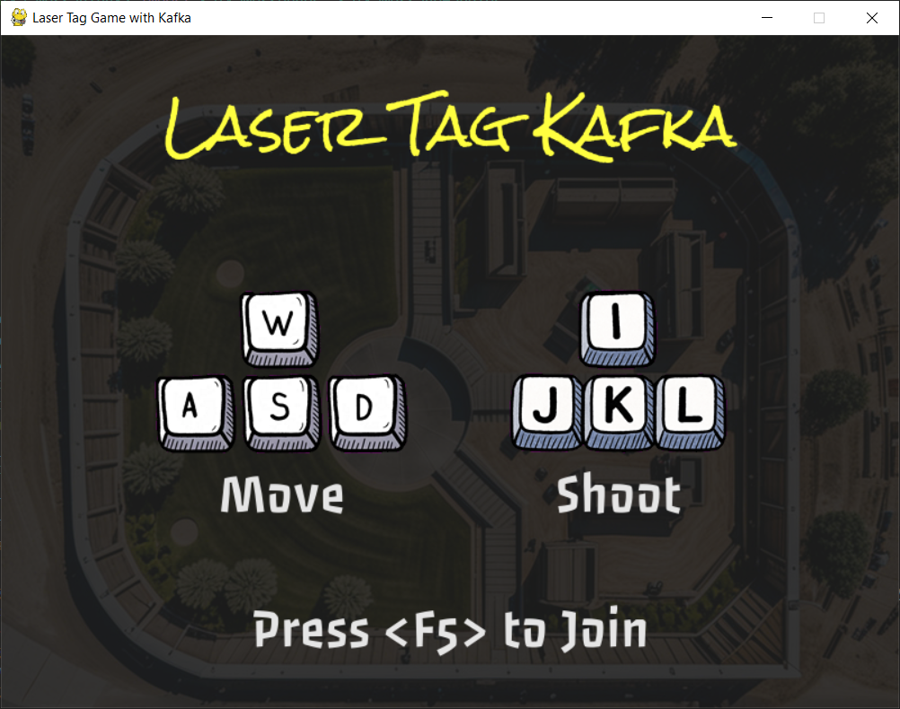

# 🌀 Laser Tag Kafka

**A playful multiplayer maze shooter—powered by Apache Kafka.**

In this fast-paced event-driven arena, each move is a message and every shot is a publish event. Jump into the chaos with your friends across instances, all connected through Kafka topics.

## 🎮 Controls

- **Player 1 Movement**: `W`, `A`, `S`, `D`  
- **Player 2 Movement**: `I`, `J`, `K`, `L`  
- Press `<F5>` to Join the game

## ⚙️ Powered By

- Python & Pygame
- Apache Kafka (Dockerized)
- Real-time messaging: Movement, shooting, collisions, deaths

## 💡 Status

Still evolving! This is a playground for game mechanics + event streaming exploration.

---

### Want to build or run?

Make sure you have Docker and Kafka running. Details to come in a later version!

